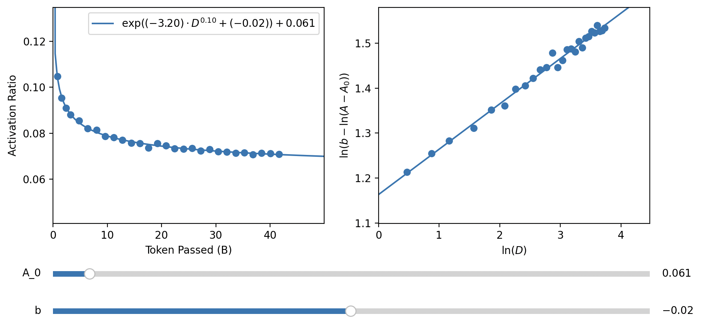

# Activation-Data Curve Fitting of Sparsing Law

This repository contains the data used for curve-fitting used in the paper *Sparsing Law: Towards Large Language Models with Greater Activation Sparsity*.
We also include codes to evaluate and visualize our fitting results.

### Data Visualization

By using the script `python show.py <model>`, you can visualize our data points of activation ratios v.s. the amount of training data. The argument `<model>` should be set to one of the prefixes of files under the folder `data` (e.g., `0.1b_relu`, `0.2b_silu`).

In the pop-up window, the left part shows our data points and the fitted power-law curve, while the right part displays the fitting results after transforming the power-law into a linear format.

The following figure shows the running results with `0.1b_relu`:



### Fitting Evaluation

We use Mean Square Error (MSE) and Mean Absolute Error (MAE) to evaluate the fitting results. We also compare our power-law formula with the commonly used logarithmic function (i.e., $`A_0+\log(a*D+b)`$). By using the script `python calc.py <model>`, you can obtain the MSE and MAE of our fitted power-laws as well as the logarithmic function.

The following texts are the running results with `0.1b_relu`, which clearly demonstrate the advantage of our power-laws over the logarithmic function:

```
MAE of power-law: 0.0004073948837353185
MAE of logarithmic function: 0.0034236725042360383
MSE of power-law: 2.6777953784674045e-07
MSE of logarithmic function: 2.1688660527788024e-05
```
