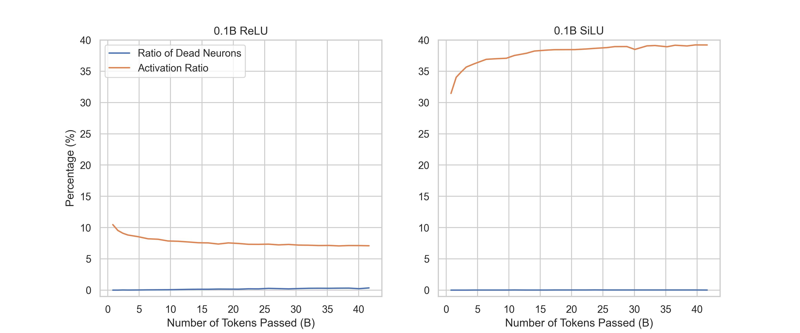

# Activation-Data Curve Fitting of Sparsing Law

This repository contains the data used for curve-fitting used in the paper *Sparsing Law: Towards Large Language Models with Greater Activation Sparsity*.
We also include codes to evaluate and visualize our fitting results.

### Data Visualization

By using the script `python show.py <model>`, you can visualize our data points of activation ratios v.s. the amount of training data. The argument `<model>` should be set to one of the prefixes of files under the folder `data` (e.g., `0.1b_relu`, `0.2b_silu`).

In the pop-up window, the left part shows our data points and the fitted power-law curve, while the right part displays the fitting results after transforming the power-law into a linear format.

The following figure shows the running results with `0.1b_relu`:


### Fitting Evaluation

We use Mean Square Error (MSE) and Mean Absolute Error (MAE) to evaluate the fitting results. We also compare our power-law formula with the commonly used logarithmic function (i.e., $`A_0+\log(a*D+b)`$). By using the script `python calc.py <model>`, you can obtain the MSE and MAE of our fitted power-laws as well as the logarithmic function.

The following texts are the running results with `0.1b_relu`, which clearly demonstrate the advantage of our power-laws over the logarithmic function:

```
MAE of power-law: 0.0004073948837353185
MAE of logarithmic function: 0.0034236725042360383
MSE of power-law: 2.6777953784674045e-07
MSE of logarithmic function: 2.1688660527788024e-05
```

### Fitting Algorithm

We use the `curve_fit` method from package `scipy` to fit our curves, which employ the Levenberg-Marquardt method.

### Study on Dead Neurons

Specifically, we define the neurons that are activated by less than 0.1% tokens in the validation dataset on average as "dead neurons". For the 0.1B ReLU-activated model and SiLU-activated model, we display their trends of activations ratios and dead neuron ratios in the following figure:



As shown in the above figure, for both models, the dead neuron ratios do not increase considerably throughout the training process. For example, the dead neuron ratio of 0.1B ReLU model increases to about 0.35% at the end of training. However, its activation ratio decreases by about 3.38% (from 10.47% to 7.09%). We can draw the following conclusion: The "dying ReLU" phenomenon does slightly exist, but is far from the fundamental cause of the decreasing activation ratio trends of ReLU-activated models.
